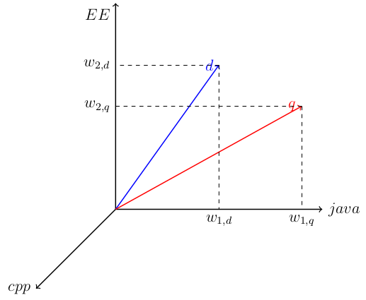
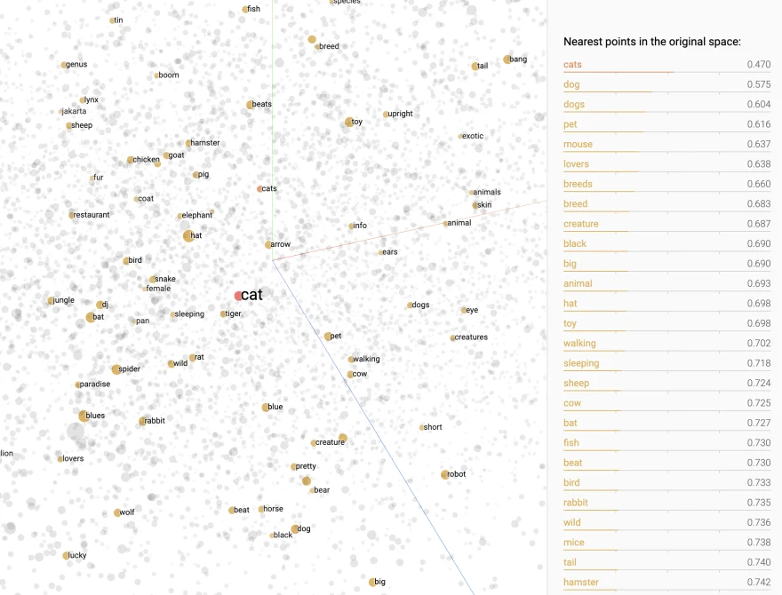

# Introduction

Dans ce TP, vous allez installer la suite ELK (Elasticsearch, Logstash, Kibana) dans sa version open source : **OpenSearch**. Le coeur de cette suite est OpenSearch (fork Elasticsearch), une base NoSQL orientée document mais aussi un moteur de recherche puissant qui est de plus en plus utilisé dans l’industrie ; non seulement pour ses capacités de recherche mais aussi pour ses fonctionnalités de Business Intelligence (BI).

Vous allez travailler sur des données factices représentant des comptes bancaires, des textes de Shakespeare et des news. A l’issue de ce TP, vous serez capable de :
- Déployer un environnement ELK en quelques minutes ;
- Ingérer des documents JSON (semi-structurés) ;
- Construire et exécuter des requêtes ;
- Fabriquer des visualisations permettant d’explorer vos données grâce à OpenSearch Dashboards (fork Kibana) ;
- Intégrer un modèle de TALN pré-entraîné pour répondre à des requêtes sémantiques ;
- Ingérer d’autres formats de données grâce à logstash.

**Evaluation** : L’évaluation portera sur un rapport d’une dizaine de pages dans lequel vous indiquerez _honnêtement_ les réponses aux questions de ce TP. Les questions sont préfixées par `(Question)`.

Le rapport est à soumettre sur Moodle avant la date indiquée.


# Installation de la suite ELK

Créer le dossier “TP-ELK”
A la racine, créer le fichier docker-compose.yml  qui contiendra toutes les instructions à la mise en place de l’environnement ELK (3 containers, un pour OpenSearch, un pour logstash et un pour OpenSearch-dashboards). Configuration :

## Images

```
opensearchproject/opensearch:3
opensearchproject/logstash-oss-with-opensearch-output-plugin:8.9.0
opensearchproject/opensearch-dashboards:3
```

## Ports

```
9200 (opensearch/http), 5601 (opensearch-dashboards/http), 5000 (logstash-oss/tcp)
```

## Réseau

```
bridge
```

Aidez-vous de la documentation https://opensearch.org/downloads.html#docker-compose pour créer votre fichier docker-compose.yml.

Exécutez 

```
sysctl -w vm.max_map_count=262144 
```

pour qu'OpenSearch se lance correctement. Commande à exécuter à chaque redémarrage ou spécifier `vm.max_map_count=262144`  dans le fichier `/etc/sysctl.conf` pour une configuration permanente. 

Lancer la commande

```
docker-compose up
```

pour construire l’environnement. 

Vérifier le bon fonctionnement de l’environnement en inspectant les logs de `docker-compose` et en vous connectant à l’URL http://localhost:9200

# Partie 1 - Gestion de données simples
## Indexation de données

Télécharger le jeu de données sur https://download.elastic.co/demos/kibana/gettingstarted/accounts.zip.


Indexer les données dans OpenSearch grâce à la commande suivante :

```
curl -H 'Content-Type: application/x-ndjson' -XPOST 'localhost:9200/bank/_bulk?pretty' --data-binary @accounts.json
```

Toutes les données sont alors envoyées dans l’index nommé `bank`.


## Prise en main d'OpenSearch
Se rendre à l’URL http://localhost:5601 puis dans `Dev Tools`.

A l’aide de la documentation disponible au lien ci-dessous, vous allez écrire les requêtes permettant de répondre à différentes questions.

Documentation utile : https://opensearch.org/docs/latest/.

## Requêtage simple 

### INDEX et UPDATE API
- (Question) Après avoir étudié la structure d’un document, ajouter un nouveau compte dont l’ID est 10001
- (Question) Mettre à jour le compte précédent en modifiant l’adresse

### DELETE API
- (Question) Supprimer le compte précédemment créé
- (Question) Supprimer tous les comptes de la ville de Nicholson (Utiliser _delete_by_query)

### GET API
- (Question) Obtenir le compte dont l’ID est 2
- (Question) Idem mais récupérer uniquement le source (champs _source)
- (Question) Idem mais en ne sélectionnant que le nom et le prénom (firstname, lastname)

### SEARCH API
- (Question) Retrouver tous les comptes
- (Question) Retrouver tous les comptes dont la ville (champs city) est Belvoir
- (Question) Retrouver tous les comptes dont la ville (champs city) est Belvoir ET l’employeur Xurban

## Visualisation des données avec OpenSearch Dashboards
Aller sur l’onglet Visualize et créer les visuels suivants :

- (Question) Métrique affichant la somme des soldes de tous les comptes. Sauver le graphique.
- (Question) Graphique barre affichant la moyenne des soldes (champ balance) selon l’état (champ state). Sauver le graphique.
- (Question) Nuage de mots représentant les villes dans lesquelles il y a le plus de comptes. Sauver le graphique.

Rendez-vous ensuite sur l’onglet Dashboard puis : 

- (Question) Réaliser un tableau de bord regroupant les 3 visuels précédents.
- (Question) Exécuter une requête dans la barre de recherche situé au dessus et remarquez que les visuels se mettent automatiquement à jour.

# Partie 2 - Gestion de documents textuels

Dans cette partie nous allons travailler avec des données principalement textuelles et nous allons palper la puissance d'OpenSearch en tant que moteur de recherche plein texte.

## Indexation de données
- Télécharger le jeu de données https://download.elastic.co/demos/kibana/gettingstarted/shakespeare_6.0.json
- Indexer les données dans OpenSearch grâce à la commande suivante :

```
curl -H 'Content-Type: application/x-ndjson' -XPOST 'localhost:9200/shakespeare/_bulk?pretty' --data-binary @shakespeare_6.0.json
```

## Recherches plein texte
OpenSearch est un puissant moteur de recherche capable de gérer des millions de documents sur une unique machine et plusieurs milliards dans un environnement distribué. 

L’objectif des questions ci-dessous est de se rendre compte de ses capacités de recherche et de la rapidité à laquelle les réponses sont données.

### SEARCH API

Répondre aux questions suivantes en utilisant l'API Search.

Documentation : 
- https://opensearch.org/docs/latest/api-reference/search/
- https://opensearch.org/docs/latest/query-dsl/full-text/query-string/

Vous pouvez répondre à toutes les questions en utilisant cett syntaxe :

```
GET shakespeare/_search?q=query OR champ:query
```

- (Question) Rechercher les documents contenant le terme KING dans les champs text_entry OU playname. Accordez deux fois plus d’importance aux documents qui contiennent le terme dans le champ play_name (astuce : KING^2).
- (Question) Rechercher les documents où l’orateur (champ speaker) CAESAR parle de Brutus (champ text_entry)
- (Question) Rechercher les documents où l’orateur(champ speaker) CAESAR ne parle PAS de Brutus (champ text_entry)
- (Question) Rechercher les documents répondant à la requête `caesar brutus calpurnia`
- (Question) Selon vous, pourquoi le quatrième document, qui contient tous les termes, n’est pas en première position ?
- (Question) Modifier la requête pour que seul le quatrième document réponde.
- (Question) Rechercher les documents répondant à la requête cesar (la faute est volontaire)
- (Question) Pourquoi aucun document ne répond ?
- (Question) Essayez maintenant avec la requête cesar~ 
- (Question) En déduire le rôle de l’opérateur ~

### AGGREGATION API

Documentation : https://opensearch.org/docs/latest/aggregations/ ou https://www.elastic.co/guide/en/elasticsearch/reference/current/search-aggregations.html (mieux expliqué mais attention à la compatibilité)

- (Question) Trouver le nombre total de pièces (champ play_name)
- (Question) En une requête, calculer le nombre de lignes (champ line_id) pour chaque pièce (champ play_name)

# Partie 3 - Recherches sémantiques

Les recherches réalisées précédemment sont principalement des recherches par mots ou par phrases basés sur le modèle `tf-idf`. Ce dernier construit un espace vectoriel dont la taille est égal au nombre total de tokens distincts dans la collection de documents. L'image ci-dessous représente un espace vectoriel avec 3 tokens distincts. Imaginez ce que cela donnerait avec 100,000 tokens distincts !



Certes, des techniques existent pour limiter l'impact des variations syntaxiques (bas/haut de casses, mots au pluriel/singulier, synonymes) mais cela pose plusieurs problèmes :
- effort requis pour paramétrer minutieusement la construction des tokens ;
- recours à des dictionnaires, notamment pour les synonymes ;
- prise en compte des points précédents pour différentes langues ;
- sens d'une phrase, paragraphe, document non pris en compte dans sa globalité.

Pour pallier ces problèmes, on peut utiliser des techniques avancées de Traitement Automatique du Langage Naturel (TALN) pour construire des espaces vectoriels _sémantiques_ où les mots, paragraphes, documents sont représentés par des vecteurs, appelés _embeddings_, encodant le sens des informations plutôt que leur syntaxe. Les espaces vectoriels associés ont une taille fixe, de quelques centaines de dimensions. Ci-dessous un exemple de ce type d'espace en 2 dimensions (source : https://dev.to/jinglescode/word-embeddings-16hb)



Grâce aux _modèles de langue_, notamment aux _transformers_ (https://arxiv.org/abs/1706.03762) pré-entraînés et proposés librement par des sociétés comme Google, OpenAI, Facebook, il est maintenant possible de construire ses propres _embeddings_ sur n'importe quel texte. 

Huggingface (https://huggingface.co/) est une plateforme proposant nombre de ces modèles pré-entraînés, en particulier des modèles de type _transformers_ que l'on peut utiliser sur nos propres données : https://huggingface.co/sentence-transformers. 

Dans ce TP, nous allons utiliser l'un de ces modèles pour construire un _embedding_ par document et nous permettre de faire des recherches sémantiques et de trouver des documents similaires.

## Téléchargement et intégration d'un modèle _sentence transformers_ à OpenSearch

Documentation : https://opensearch.org/docs/latest/search-plugins/neural-search/


- Se placer dans le `Dev Tools` d'OpenSearch.
- Exécuter la requête suivante pour autoriser le chargement de modèles.
```
PUT _cluster/settings
{
  "persistent": {
    "plugins.ml_commons.allow_registering_model_via_url": true
  }
}
```
- Exécuter la requête suivante pour créer un groupe de modèles  et noter le `group_id`
```
POST /_plugins/_ml/model_groups/_register
{
  "name": "sentence_transformers",
  "description": "Groupe pour les modèles sentence transformers"
}
```
- Exécuter la requête suivante pour télécharger le modèle puis noter le `task_id` (attention à remplacer le `group_id` par la valeur notée précédemment)
```
POST /_plugins/_ml/models/_register
{
  "name": "huggingface/sentence-transformers/all-MiniLM-L6-v2",
  "version": "1.0.1",
  "model_group_id": "<group_id>",
  "model_format": "TORCH_SCRIPT"
}
```
Une liste de modèles pré-entraînés est disponible ici https://opensearch.org/docs/latest/ml-commons-plugin/pretrained-models/

- Exécuter la commande suivante en spécifiant le `task_id` noté précédemment et patienter jusqu'à ce que la tâche soit marquée `COMPLETED`. Noter le `model_id`.
```
GET /_plugins/_ml/tasks/<task_id>
```
- Charger le modèle en mémoire en spécifiant le `model_id` noté précédemment.
```
POST /_plugins/_ml/models/<model_id>/_deploy
```
- Créer une pipeline d'ingestion qui indique à OpenSearch de calculer l'embedding sur le texte d'un champ d'un document json. Spécifier le `model_id` dans le champ associé. Exécuter la commande suivante :
```
PUT _ingest/pipeline/news-nlp-pipeline
{
  "description": "Pipeline calculant l'embedding sur le texte du champ 'short description'",
  "processors" : [
    {
      "text_embedding": {
        "model_id": "<model_id>",
        "field_map": {
           "short_description": "text_embedding"
        }
      }
    }
  ]
}
```
- Créer le mapping qui permet d'indiquer comment chaque champ doit être indexé. Noter que le champ `short_description` est de type texte. Grâce à l'étape précédente, le champ `text_embedding`, contenant l'_embedding_ de la description sera automatiquement créé.
```
PUT /news
{
  "settings": {
    "index.knn": true,
    "default_pipeline": "news-nlp-pipeline"
  },
  "mappings": {
    "properties": {
      "text_embedding": {
        "type": "knn_vector",
        "dimension": 384,
        "method": {
          "name": "hnsw",
          "space_type": "l2",
          "engine": "nmslib",
          "parameters": {
            "ef_construction": 128,
            "m": 24
          }
        }
      },
      "link": { "type": "keyword" },
      "headline": { "type": "text" },
      "category": { "type": "keyword" },
      "short_description": { "type": "text" },
      "authors": { "type": "keyword" },
      "date": { "type": "date" }
    }
  }
}
```

## Indexation des données

Le jeu de données est un ensemble de `210,294` news entre 2012 et 2022 au format JSON.

- Télécharger les données https://www.kaggle.com/datasets/rmisra/news-category-dataset?resource=download ou me demander si vous n'avez pas de compte sur Kaggle.
- Lancer, lire et exécuter le notebook `notebooks/ingest_news.ipynb`. Ce notebook contient le code nécessaire à la lecture des news et à leur ingestion dans elasticsearch.

## Recherches

En vous aidant de l'exemple ci-dessus et en remplaçant les parties entre chevrons `<>`, répondre aux questions suivantes.

```
GET <index>/_search?size=10
{
  "query": {
    "neural": {
      "<embedding_field>": {
        "query_text": "Requête en langage naturel",
        "model_id": "<model_id>",
        "k": 10
      }
    }
  },
  "fields": ["liste des champs à afficher"],
  "_source": false
}
```

- (Question) Rechercher "Usage of artificial intelligence in medicine". Afficher les champs `headline`, `short_description`, `date` et `link`.
- (Question) Rechercher les articles similaires à celui-ci https://www.huffpost.com/entry/15-comedy-documentaries-worth-watching-on-netflix-photos_n_1619966. Copier / coller le début de l'article dans la requête.

# Partie 4 - Pour aller plus loin : Logstash
Logstash est un formidable outil pour le traitement et l’ingestion de données, notamment dans OpenSearch.

- Etudier logstash sur la page https://opensearch.org/docs/latest/tools/logstash/index/
- Télécharger la carte des hôtels classés en IDF ici https://www.data.gouv.fr/fr/datasets/la-carte-des-hotels-classes-en-ile-de-france-idf/
puis écrire une configuration Logstash pour ingérer ces données dans OpenSearch
- (Question) Développez un tableau de bord sur ces données. Ce tableau devra comporter une carte géographique des hôtels classés en fonction de leur nombre d’étoiles.